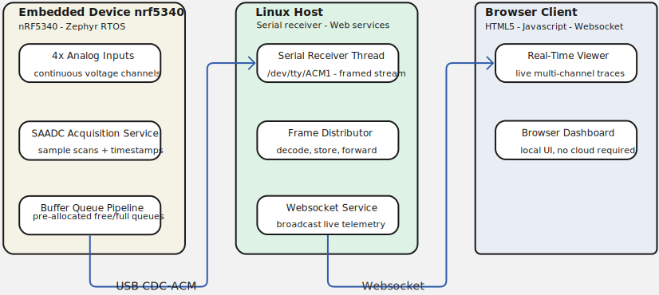
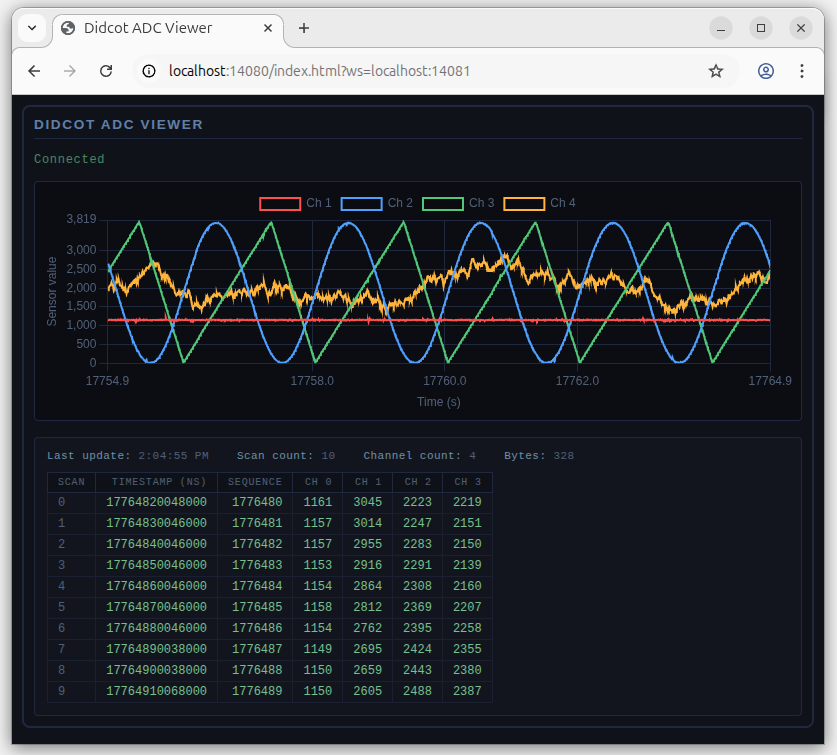
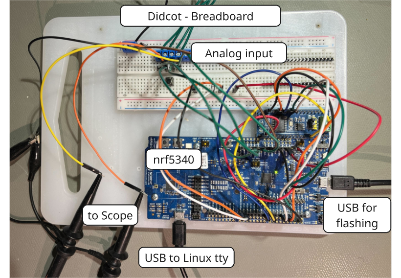

# Didcot - A Real-Time ADC Streaming Pipeline

[](https://github.com/david-erb/didcot/actions/workflows/ci.yml) [](https://github.com/david-erb/didcot/tags) [](https://github.com/david-erb/didcot)

An nRF5340 samples four analog channels continuously, frames the data into a buffer queue, and streams it over USB CDC-ACM to a Linux server. The server distributes frames over a local WebSocket connection to a browser trend display.

This came out of a need for an instrumented view at the output of an ADC pipeline — not a scope, not a data file, but a live transport-layer readout of what is actually moving through the system. The signal generator in `champaign` makes a convenient test source.

`didcot` is part of the **[Embedded Applications Lab](https://david-erb.github.io/embedded)** — a set of working applications built on a shared set of reusable libraries across MCU, Linux, and RTOS targets.



## Browser display

Here I am feeding 4 analog voltage channels from the signal generator app running on the ESP-32 app.



## Pipeline instrumentation

The service framework emits per-stage throughput numbers every second. `dropped` appears the moment a buffer cannot be handed off downstream — no debugger, no post-hoc log analysis.

```
# Pipeline flowing
[INFO ] main: dtservice_adc2bq: 117984 -> 126224 | ok | ok |=| dtservice_bq2iox: 126224 -> 3419 | ok | ok

# Transmit path stalled (server not connected)
[INFO ] main: dtservice_adc2bq: 104256 -> 111475 | ok | ok |=| dtservice_bq2iox: 111475 -> 2047 | ok | dropped 109428 bytes
```

## Architecture

The pipeline is built from composable services using a common `dtservice` interface — start, stop, poll, format status — that runs identically on Zephyr, FreeRTOS, and Linux pthreads. New stages can be added or reordered without touching existing service code.

**On the nRF5340** (`apps/zephyr/didcot_adc/src/main.c`), two services run under the Zephyr scheduler. `dtservice_adc2bq` frames SAADC scans into a pool of fixed-size, pre-allocated buffers. `dtservice_bq2iox` drains the full-buffer queue to the USB CDC-ACM port. The free→full→free buffer pool bounds memory, eliminates heap allocation in the data path, and provides natural backpressure. Priority assignment is deliberate: the framing service runs at `URGENT_LOW`, above the transmit path at `NORMAL_HIGH`, so the ADC side never waits on the transport side.

**On Linux** (`apps/linux/didcot_server/src/main.c`), three threads handle serial receive, WebSocket broadcast, and HTTP control. The HTTP server is minimal by design — its only job is accepting a stop command so the pipeline can be shut down cleanly from the command line.

**Hardware interfaces** (`dtadc`, `dtiox`, `dtinterval`, `dtmcp4728`) are defined as vtable-based handles. Concrete platform implementations are injected at `main` scope; service and library code is platform-agnostic. The same ADC service that runs on Zephyr runs against a stub in the Linux unit test harness.

**The optional ESP32 component** (`apps/espidf/didcot_dac/main/main.c`) runs the MCP4728 quad-channel DAC service from `champaign`, integrated here for self-contained pipeline evaluation without external equipment.

## Dependencies

Pulled in as git submodules under `submodules/`:

- [dtcore](https://github.com/david-erb/dtcore) — error propagation, logging, string utilities
- [dtmc_base](https://github.com/david-erb/dtmc_base) — buffer queues, task runtime, service lifecycle
- [dtmc_services](https://github.com/david-erb/dtmc_services) — ADC, I/O, and framing service implementations
- [dtmc_zephyr](https://github.com/david-erb/dtmc_zephyr) — Zephyr platform layer: SAADC, USB CDC-ACM
- [dtmc_espidf](https://github.com/david-erb/dtmc_espidf) — ESP-IDF platform layer: MCP4728 DAC, interval timer
- [dtmc_linux](https://github.com/david-erb/dtmc_linux) — Linux platform layer: serial, WebSocket server, HTTP server

Unit tests run on all three platforms via `didcot_tests/`, exercising shared library code against real hardware interfaces.

## Building

Requires [Zephyr SDK and west](https://docs.zephyrproject.org/latest/develop/getting_started/index.html) for the nRF5340 target, and CMake for the Linux server. Clone the didcot repo with **--recurse-submodules**, then:

**nRF5340 firmware:**
```bash
cd apps/zephyr/didcot_adc
west build -b nrf5340dk_nrf5340_cpuapp
west flash
```

**Linux server:**
```bash
cd apps/linux/didcot_server
cmake -S . -B build
cmake --build build
build/didcot_server
```

**ESP32 DAC source (optional):** requires [ESP-IDF](https://docs.espressif.com/projects/esp-idf/en/latest/).
```bash
cd apps/espidf/didcot_dac
idf.py set-target esp32
idf.py build
idf.py flash
```

The ESP32 DAC component uses the same hardware as [`champaign`](https://github.com/david-erb/champaign/) — an ESP32 driving an MCP4728 quad-channel DAC over I2C — so the two can share a bench setup.

## Lab pictures

nRF5340 DK connects via the USB port silkscreened **nRF5340-USB** to the lab computer. The Linux server opens the CDC-ACM serial device; the browser connects to `localhost`. No network configuration, no drivers beyond what Zephyr's USB stack provides.



## License

MIT
